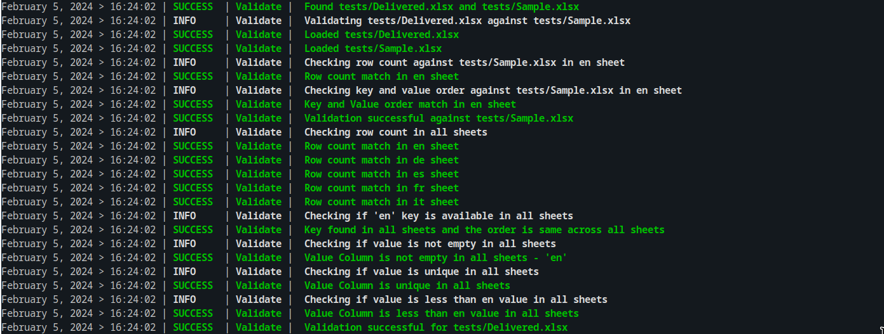
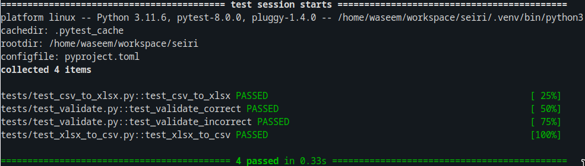

# Seiri
[](https://github.com/waseemr02/seiri/actions/workflows/seiri_test.yml)
[](https://app.codacy.com/gh/waseemR02/seiri/dashboard?utm_source=gh&utm_medium=referral&utm_content=&utm_campaign=Badge_grade)
[](https://app.codacy.com/gh/waseemR02/seiri/dashboard?utm_source=gh&utm_medium=referral&utm_content=&utm_campaign=Badge_coverage)

Tool for csv$\Leftrightarrow$xlsx conversions and validation checks

## Installation
Create a virtual environment before installing dependencies
```
pip install .
```

## Usage
This tool is written as library for future adaptation to gui

But each class file can be run as a separate script

### Transform
```
usage: transform.py [-h] [--cx CX] [-o OUTPUT] [--xc XC] [--log LOG] [-v]

options:
  -h, --help            show this help message and exit
  --cx CX               Convert csv to xlsx
  -o OUTPUT, --output OUTPUT
                        output file
  --xc XC               Convert xlsx to csv
  --log LOG             path to log file
  -v, --verbose
```

### Validate
```
usage: validate.py [-h] [--against AGAINST] [--log LOG] in_xlsx

positional arguments:
  in_xlsx            path to xlsx to validate

options:
  -h, --help         show this help message and exit
  --against AGAINST  path to xlsx to validate against
  --log LOG          path to log file
```
### Example Usage

```
python -m seiri.transform --cx tests/data/Sample.csv -o sample.xlsx --verbose
```

-----------------
```
python -m seiri.validate tests/data/Delivered_correct.xlsx
```

```
python -m seiri.transform --xc tests/data/Delivered_correct.xlsx -o sample.csv  --verbose
```


## Testing
Install the testing dependencies
```
pip install .[test]
```

Run the following
```
pytest -v
```


## Milestones
- [$\checkmark$] Convert csv to xlsx
- [$\checkmark$] Validating given Excel with rules
- [$\checkmark$] Converting Excel to csv again
- [$\checkmark$] Add Spell check on `en` column
